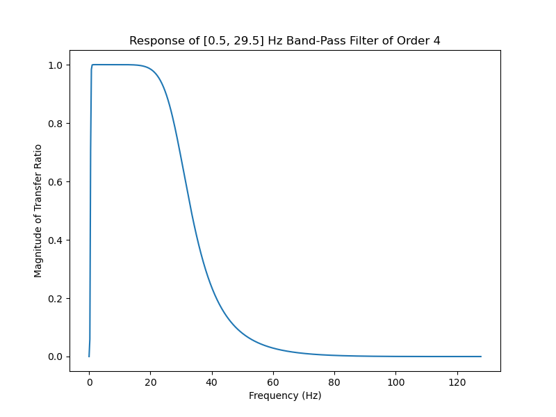

# Brain-BioAmp-Firmware
Firmware for Brain-BioAmp hardware from Upside Down Labs

| No. | Program| Description |
| ---- | ---- | ---- |
|1 | [FixedSampling](1_FixedSampling)| Sample from ADC at a fixed rate for easy processing of signal.|
|2 | [EEGFilter](2_EEGFilter)| A 0.5 - 29.5 Hz band-pass filter sketch for clean Electroencephalography.|

Compatibility of various boards with Brain-BioAmp sensors
<table>
    <thead>
        <tr>
            <th>No.</th>
            <th>Development Board</th>
             <th>Maximum ADC Resolution</th>
            <th>Sensor</th>
            <th>Compatibility</th>
        </tr>
    </thead>
    <tbody>
        <tr>
            <td >1</td>
            <td align= "center" >Arduino UNO R3 & Maker UNO</td>
            <td align = "center" >10 bits</td>
            <td>Bioamp EXG Pill</td>
            <td align = "center">✅</td>
        </tr>
        <tr>
            <td >2</td>
            <td align = "center" >Arduino UNO R4 Minima & Arduino UNO R4 Wifi</td>
            <td align = "center">14 bits</td>
            <td>Bioamp EXG Pill</td>
            <td align= "center">✅</td>
        </tr>
        <tr>
            <td >3</td>
            <td align = "center" >Raspberry Pi Pico</td>
            <td align = "center" >12 bits</td>
            <td>Bioamp EXG Pill</td>
            <td align = "center">❌</td>
        </tr>
       <tr>
             <td >4</td>
            <td align= "center"  >ESP32 C3 MINI</td>
           <td align = "center" >12 bits</td>
            <td align = "center">Bioamp EXG Pill</td>
            <td align= "center">❌</td>
        </tr>
        <tr>
             <td >5</td>
            <td align= "center"  >Arduino Due</td>
           <td align = "center" >12 bits</td>
            <td>Bioamp EXG Pill</td>
            <td align = "center">✅</td>
        </tr>
        <tr>
             <td>6</td>
            <td align= "center"  >Arduino Nano</td>
           <td align = "center" >10 bits</td>
            <td>Bioamp EXG Pill</td>
            <td align = "center">✅</td>
        </tr>
        </tbody>
    </table>

## Examples

1. **EEG Filter**

    A band-pass filter for EEG signals between 0,5 Hz and 44.5 Hz 

    
